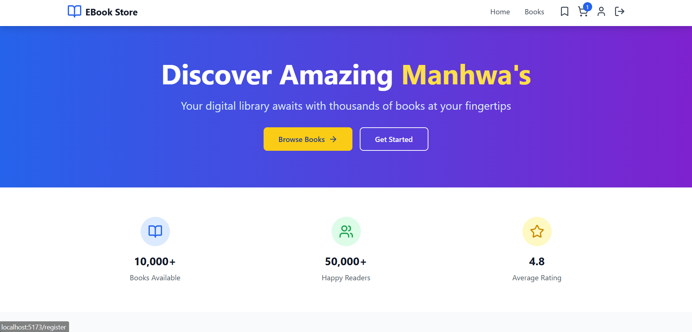
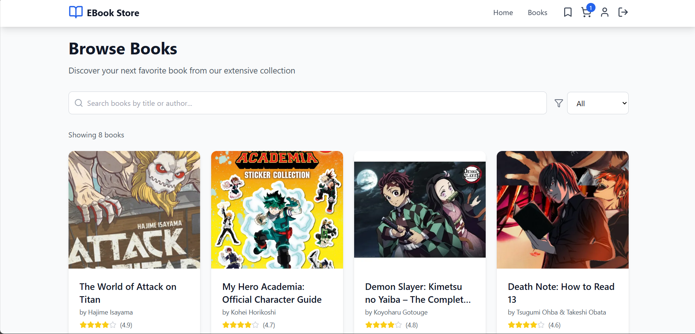
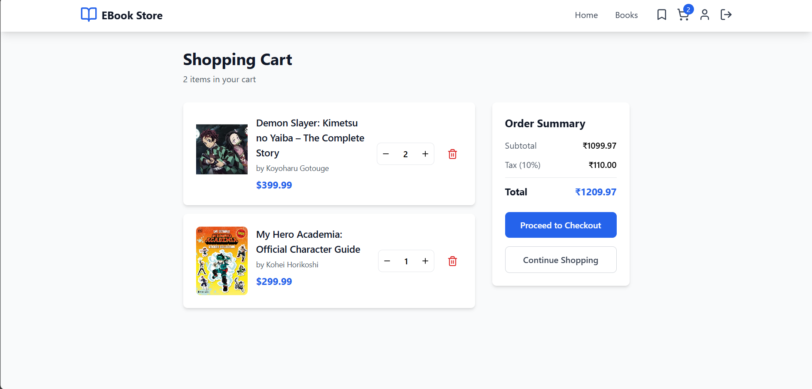
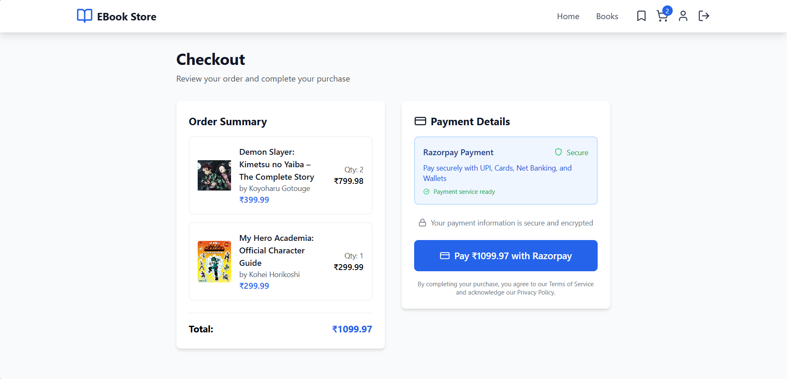
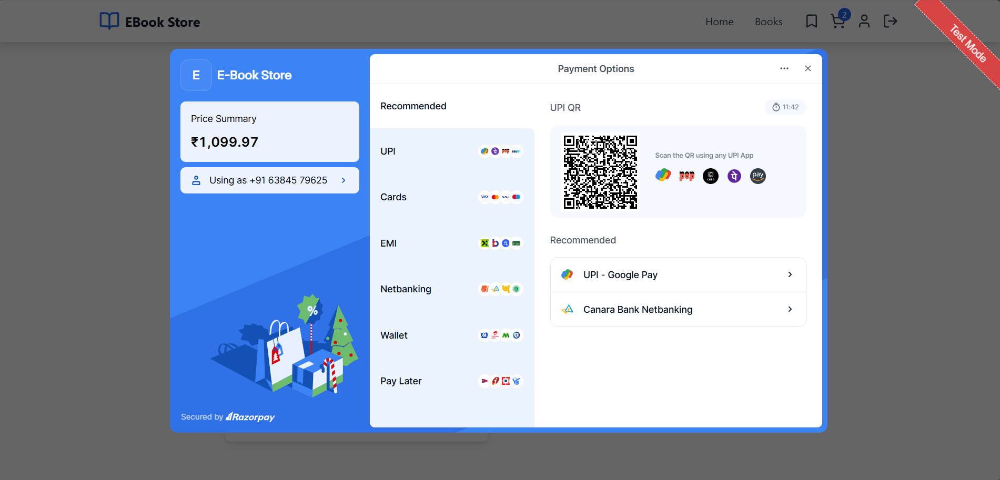
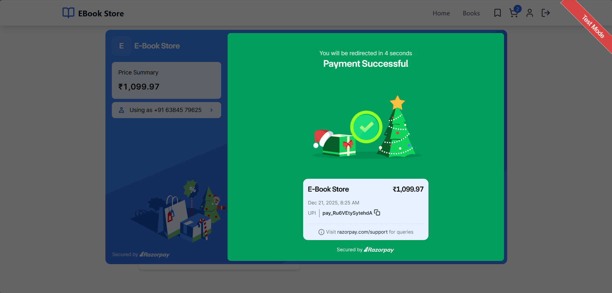
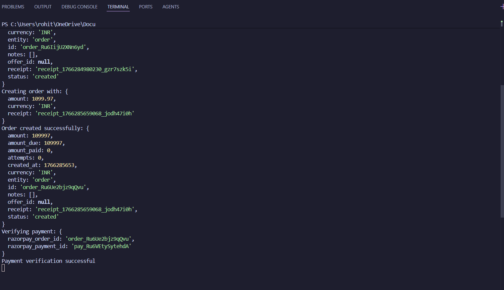
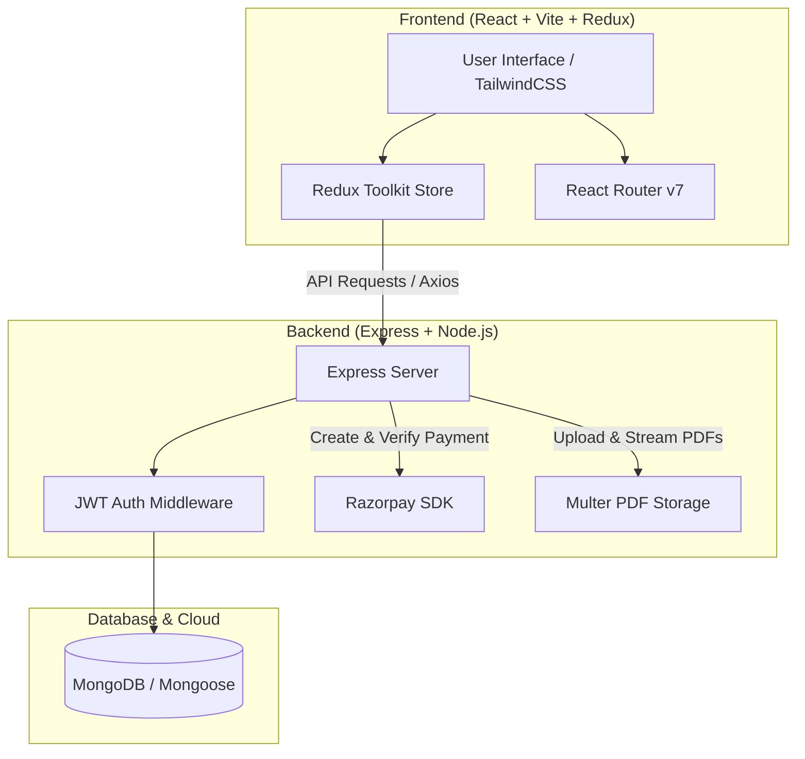

# 📚 OtakuReads

OtakuReads is a premium, full-stack manga and digital e-book e-commerce web application. Designed for readers who want a seamless, engaging experience browsing, purchasing, and reading digital books online. The platform includes a responsive user interface, a robust RESTful API, Razorpay payment gateway integration, secure PDF delivery, and a comprehensive admin management dashboard.

---

## 🎨 User Interface Preview

Here are some screenshots showcasing the modern dark-themed user interface:

| Home Page | Books Catalog |
|:---:|:---:|
|  |  |

| Shopping Cart | Checkout & Coupon |
|:---:|:---:|
|  |  |

| Razorpay Payment Gateway | Paid Order Status |
|:---:|:---:|
|  |  |

| Order Confirmation |
|:---:|
|  |

---

## 🏗️ System Architecture



---

## ✨ Features

### 👤 User Authentication & Authorization
- **Secure Registration & Login**: Leverages password hashing (`bcryptjs`) and stateless token authorization (`jsonwebtoken`).
- **Role-Based Guards**: Restricts dashboard access to administrators and blocks unauthorized users at both the router and controller levels.

### 📖 Interactive E-Book Catalog
- **Advanced Filtering**: Filter books by price range, star rating, and categories (e.g., Manga, Fiction, Programming).
- **Infinite Browsing & Pagination**: Streamlined catalog loading.
- **Detailed Book Pages**: Detailed description, cover previews, community reviews, and quick actions.

### 🛒 Cart & Wishlist Lifecycle
- **Persistent Cart State**: Manage item quantities with instant total recalculation managed by Redux Toolkit.
- **Wishlist Syncing**: Add manga/e-books to a wishlist that is persistent and synced with MongoDB.

### 💳 Razorpay Payments
- **Secure Integration**: Launches Razorpay checkout modals directly from the checkout page.
- **HMAC-SHA256 Verification**: Server-side signature validation secures payment authenticity before marking orders as paid.
- **Webhook Handlers**: Listens for webhook events to handle async payment notifications.

### 🎫 Coupon & Discount Engine
- **Promo Codes**: Apply coupons during checkout to receive real-time percentage discounts.
- **Admin Management**: Controls maximum coupon uses, active statuses, and expiration dates.

### 📂 PDF Book Delivery
- **Safe Uploads**: Admins can upload e-book PDFs (up to 100MB) using custom filename sanitation.
- **Protected File Streaming**: E-books can be read/streamed securely via dedicated backend download endpoints.

### 🛠️ Admin Dashboard
- **Content Management**: Complete CRUD operations on books.
- **Order Moderation**: View all transactions and update shipping/delivery statuses.
- **Review Moderation**: Delete or moderate book reviews to maintain community guidelines.

---

## 🛠️ Tech Stack

- **Frontend**: React 18, TypeScript, Vite, Redux Toolkit, TailwindCSS v3, Lucide React, Axios, React Hot Toast
- **Backend**: Node.js, Express, MongoDB, Mongoose, JWT, bcryptjs, Multer, Razorpay SDK
- **Testing**: Python, Pytest, Playwright (E2E), Httpx (API)

---

## 📂 Project Structure

```
OtakuReads/
├── backend/                  # Express API server
│   ├── config/               # Database connections
│   ├── controllers/          # Business logic handlers
│   ├── middleware/           # Auth and error handlers
│   ├── models/               # MongoDB Mongoose schemas
│   ├── routes/               # Express endpoints
│   ├── uploads/              # Uploaded PDF files
│   └── seed.js               # DB seed script
├── src/                      # React frontend
│   ├── components/           # Reusable UI elements
│   ├── pages/                # Views (Home, Catalog, Admin Dashboard, etc.)
│   ├── store/                # Redux state slices
│   └── lib/                  # API configurations
├── Testing/                  # Python E2E & API test suites
│   ├── api/                  # Pytest API integration tests
│   └── e2e/                  # Playwright web automation tests
└── tests/                    # Alternative Python test suite
```

---

## 🚀 Getting Started

### Prerequisites
- Node.js v18+
- MongoDB instance (Local or Atlas)
- Razorpay developer account (for test payments)

### 1. Clone & Set Up Environment

#### Backend Setup
1. Navigate to the backend directory:
   ```bash
   cd backend
   ```
2. Install dependencies:
   ```bash
   npm install
   ```
3. Create a `backend/.env` file and populate it:
   ```env
   PORT=5000
   MONGO_URI=your_mongodb_connection_uri
   JWT_SECRET=your_jwt_signing_secret
   RAZORPAY_KEY_ID=your_razorpay_key_id
   RAZORPAY_KEY_SECRET=your_razorpay_key_secret
   RAZORPAY_WEBHOOK_SECRET=your_razorpay_webhook_secret
   ```
4. Seed the database with mock books and an admin user:
   ```bash
   npm run seed
   ```
   > **Default Admin Account**: `admin@otakureads.com` / `admin123`
5. Run the dev server:
   ```bash
   npm run dev
   ```

#### Frontend Setup
1. Go back to the root directory and install dependencies:
   ```bash
   npm install
   ```
2. Create a `.env` file in the root directory:
   ```env
   VITE_API_URL=http://localhost:5000
   VITE_RAZORPAY_KEY_ID=your_razorpay_key_id
   ```
3. Run the Vite developer server:
   ```bash
   npm run dev
   ```

---

## 🧪 Testing Suite

The repository is equipped with robust API integration and E2E browser test suites built using Python, `pytest`, and `Playwright`.

### Running Tests
1. Navigate to the `Testing/` directory:
   ```bash
   cd Testing
   ```
2. Create and activate a virtual environment:
   ```bash
   python3 -m venv .venv
   source .venv/bin/activate
   ```
3. Install testing dependencies:
   ```bash
   pip install -r requirements.txt
   playwright install
   ```
4. Run all tests:
   ```bash
   pytest
   ```
   To run API integration tests or E2E browser tests separately:
   ```bash
   pytest api/    # Runs API endpoint test suite
   pytest e2e/    # Runs E2E Playwright tests (headless by default)
   ```
